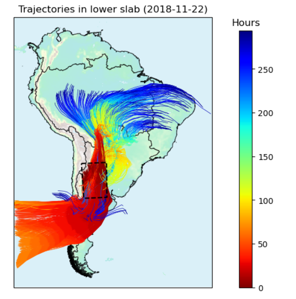

# run2LDRM

<!-- {width=125} -->

https://github.com/user-attachments/assets/297534c8-fec5-4cac-a157-38324c8624fd

  

This repository contains the CLI program of the moisture tracking model 2L-DRM. The model’s primary output is $\rho$, the fraction of precipitation that originates as evaporation from different source regions. **The program is entirely written in Fortran and is computationally very efficient, since it was developed to work with high-resolution climate models**. 

This is a revised version of the original 2L-DRM model (https://doi.org/10.1175/JHM-D-19-0101.1). An article describing the theoretical details of this new version will be published soon, but they may not be necessary to know from a user’s perspective. **Since the program is new, any suggestions for making it easier to use are very welcome!**.

To build and compile it, you need to have the following installed:
1. A Fortran compiler that supports the module ieee_arithmetic is required (any compiler that implements the Fortran 2003 standard or higher should be fine). I did it with the compiler included in GNU/GCC 9.3.0. 
2. Fortran Package Manager (fpm). See intructions for installing it here: https://github.com/fortran-lang/fpm. I installed it using a conda environment.
3. OpenMP library (optional). This allows parallelization, making the calculation much faster.

Then you can clone this repository in a local directory: 

    clone https://github.com/erickjomp/2L-DRM.git

And you can build the 2L-DRM program using:

    fpm build

And install it using:

    fpm install

In addition, if using a Linux system, you may want to add `~/.local/bin/` to your PATH environment. For that, you can edit your `~/.profile` file by adding a line like this:

    export PATH=~/.local/bin/:$PATH

Then you will be able to call the program `run2LDRM` from any directory. For a list of the required and optional inputs of this program, please use:

    run2LDRM --help

## Notes
- The data in the input binary files of run2LDRM program should be in Fortran-like memory order (read more about it here https://manik.cc/2021/02/25/memory-order.html). As a rule of thumb, if you want an input binary file with dimensions (nx, ny, nslabs, ntimes) and you are going to write it from a Python numpy array, the numpy array must have dimensions (ntimes, nslabs, ny, nx), where nslabs should be 2.
- The precipitable water flux at the interslab (PWflux), which has to be provided as an input binary file, can be calculated by $\rho_{air} w_{wind} q$, where $\rho_{air}$ is the density of the air, $w_{wind}$ is the vertical wind velocity and $q$ is the specific humidity at the interslab pressure level.
- To make the model easier to use, a preprocessing program is also provided (https://github.com/erickjomp/2L-DRM-preprocessing). It takes standard WRF outputs as input and generates the necessary files for running the 2L-DRM.
